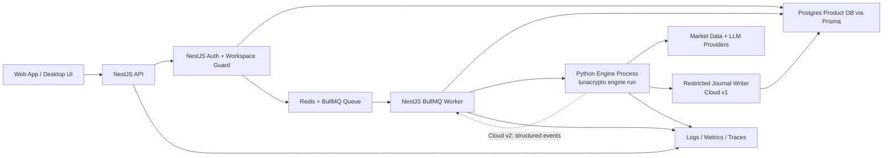

# Kế Hoạch Cloud, Job Queue Và Tenant Isolation

Ngày: 2026-05-13  
Phạm vi: định hướng áp dụng cloud runtime, job queue và tenant isolation vào codebase LunaCrypto / LunaPerception hiện tại.

## 1. Tóm Tắt Điều Hành

Hướng đúng cho repo này là:

```text
Frontend
  -> NestJS product API
  -> Postgres/Prisma product database
  -> Redis/BullMQ job queue
  -> Python research engine workers
  -> market data providers / LLM providers
```

Không nên biến Python AI service thành web backend chính. Python nên giữ vai trò research engine. NestJS nên sở hữu auth, workspace/tenant policy, product API, job submission, job status và read API cho frontend.

Repo hiện đã có nền móng ban đầu khá đúng:

- `apps/api/src/jobs/jobs.service.ts` đã hỗ trợ BullMQ khi có `REDIS_URL`, đồng thời có memory và inline fallback cho local/dev.
- `apps/api/src/jobs/python-engine.client.ts` đã gọi Python engine thông qua JSON request file.
- `apps/ai-service/tradingagents/engine/schemas.py` đã định nghĩa `EngineRunRequest` và `EngineRunResult`.
- `apps/ai-service/tradingagents/engine/runner.py` đã persist engine run với `workspace_id`.
- `packages/database/prisma/schema.prisma` đã có nhiều bảng gắn với `workspaceId`.
- API tests đã có test workspace scoping và engine request contract.

Vì vậy việc tiếp theo không nên là rewrite. Nên harden boundary hiện có thành kiến trúc cloud đúng nghĩa.

## 2. Kiến Trúc Mục Tiêu Đã Điều Chỉnh



Luật cứng:

```text
Frontend không bao giờ gọi Python trực tiếp.
NestJS không chứa research logic.
Python không sở hữu auth hay tenant policy.
Redis/BullMQ không phải source of truth.
Postgres product DB là canonical cloud database của NestJS.
```

Luồng hợp lý nhất cho giai đoạn gần nhất là **Cloud v1 thực dụng**:

```text
1. Frontend gửi request tới NestJS API.
2. NestJS chạy auth + workspace guard.
3. NestJS tạo durable product state trong Postgres:
   - research_runs placeholder
   - research_jobs
   - audit/event ban đầu
4. NestJS enqueue job vào Redis/BullMQ.
5. NestJS/BullMQ worker consume job.
6. Worker update research_jobs thành running trong Postgres.
7. Worker spawn Python engine process bằng JSON contract.
8. Python engine chạy research graph, gọi provider/LLM.
9. Python ghi journal artifacts vào Postgres qua restricted journal writer role.
10. Worker nhận EngineRunResult, update research_jobs final status.
11. Frontend đọc status/result qua NestJS API, không đọc Redis hoặc Python trực tiếp.
```

Redis chỉ giữ job execution state tạm thời. Trạng thái bền vững phải nằm trong Postgres, đặc biệt là `research_jobs`, `research_runs`, `run_events`, thesis, snapshots và artifact chính.

Workflow này là lựa chọn hợp lý nhất hiện tại vì:

- tận dụng được `PythonEngineClient` và engine JSON contract hiện có;
- không ép Python thành web backend;
- không overengineering bằng Temporal/event sourcing quá sớm;
- vẫn giữ NestJS là owner của product DB, auth, workspace và job lifecycle;
- chỉ cho Python ghi phần journal bằng role hạn chế, giảm rủi ro tenant/security.

Cloud v2 nên chuyển dần sang:

```text
Python Engine -> structured events -> NestJS BullMQ Worker -> Postgres
```

Ở Cloud v2, Python không ghi DB trực tiếp nữa. NestJS worker sẽ persist toàn bộ journal artifacts. Đây là kiến trúc sạch hơn, nhưng chưa cần làm ngay nếu mục tiêu hiện tại là đưa cloud/job queue chạy ổn trước.

## 3. Ranh Giới Trách Nhiệm

| Concern | Owner | Lý do |
|---|---|---|
| Auth, user identity, workspace membership | NestJS | Đây là security/product boundary |
| Request validation và permission | NestJS | Phải reject request sai tenant trước khi đưa vào queue |
| Job submission, status, cancellation | NestJS + BullMQ | Product API cần lifecycle ổn định |
| Research execution | Python engine | Đây là core hiện có của repo |
| Journal writes trong lúc run | Python engine trước mắt, sau đó có thể tách thành DB/event adapter | Engine biết artifact nào sinh ra lúc nào |
| Read API cho frontend | NestJS | Frontend contract và tenant filtering nằm ở backend |
| Provider/LLM secrets | Secret manager, inject vào worker | Tránh leak secret qua API/job payload |
| Observability | API và worker cùng ghi | Cần trace được từ request đến job đến engine |

## 3.1 NestJS Nên Có Product DB Riêng

Có. NestJS nên có DB riêng về mặt ownership. Nói chính xác hơn: cloud product database phải thuộc sở hữu của NestJS/API layer, không thuộc sở hữu của Python engine.

Trong kiến trúc này nên có các lớp lưu trữ khác nhau:

| Storage | Owner | Vai trò |
|---|---|---|
| SQLite local journal | Python engine | Local/offline/dev journal, chạy độc lập khi chưa có cloud |
| Postgres app/product DB | NestJS | Canonical cloud database cho users, workspaces, jobs, billing, settings, web/product state |
| Postgres journal/research DB hoặc schema | Python/NestJS tùy giai đoạn | Research artifacts: runs, theses, snapshots, debates, run events |
| Redis | NestJS/BullMQ | Queue/broker tạm thời, không phải source of truth |

Điểm quan trọng: "DB riêng cho NestJS" là đúng. Backend cần chỗ riêng để lưu dữ liệu web/product như user, workspace, membership, job status, billing, settings, provider credential refs. Python không nên sở hữu các bảng đó.

Nhưng có hai cách tách:

### Cách 1 - Một Postgres Instance, Tách Schema Và Role

Đây là cách nên dùng trước.

Khuyến nghị thực dụng:

```text
Postgres database: lunaperception

schema app:
  users
  workspaces
  workspace_memberships
  research_jobs
  provider_credential_refs
  billing/usage sau này

schema journal:
  research_runs
  market_snapshots
  signal_snapshots
  trade_theses
  scenarios
  run_events
  llm_calls
  data_freshness_checks

schema audit:
  security_audit_logs
  admin_actions
```

Ưu điểm:

- ít infra hơn;
- backup/restore đơn giản hơn;
- NestJS có thể query product + journal dễ hơn;
- vẫn tách ownership bằng schema và DB role;
- phù hợp giai đoạn Cloud v1.

Role nên tách:

```text
nestjs_app_role:
  read/write app.*
  read/write journal.*
  read/write audit.*

python_journal_writer_role:
  insert/update journal.research_runs
  insert/update journal.run_events
  insert/update journal.trade_theses
  insert/update journal.market_snapshots
  insert/update journal.signal_snapshots
  không có quyền app.users/app.workspaces/app.workspace_memberships/billing/secrets
```

### Cách 2 - Hai Physical DB Riêng

Mô hình:

```text
app_db:
  owner: NestJS
  data: users, workspaces, memberships, research_jobs, billing, settings, credential refs

journal_db:
  owner: Python research engine hoặc journal service
  data: research_runs, run_events, theses, snapshots, debates, scenarios, evaluations
```

Mô hình này cũng hợp lý, nhưng chưa nên làm ngay nếu chưa có lý do rõ.

Ưu điểm:

- isolation mạnh hơn;
- Python không thể đụng DB web/user;
- research workload nặng không ảnh hưởng trực tiếp app DB;
- sau này dễ scale journal/search/analytics riêng.

Nhược điểm:

- NestJS read API vẫn phải đọc journal data, nên hoặc NestJS cần connect cả hai DB, hoặc phải có sync/event ingestion;
- không join trực tiếp users/workspaces/jobs với research artifacts dễ như một DB;
- migration, backup, transaction, local dev phức tạp hơn;
- dễ tạo eventual consistency bug giữa `research_jobs` ở app DB và `research_runs` ở journal DB.

Khuyến nghị thực tế:

```text
Giai đoạn hiện tại:
  1 Postgres instance/database
  tách schema app/journal/audit
  tách DB role nestjs_app_role và python_journal_writer_role

Khi scale hơn:
  tách journal sang physical journal_db nếu workload research lớn,
  hoặc nếu security/compliance yêu cầu hard isolation.
```

NestJS nên là service duy nhất có quyền đọc/ghi đầy đủ vào product DB. Python engine chỉ nên có một trong hai quyền sau:

1. không có quyền DB trực tiếp, chỉ emit structured events để NestJS worker persist;
2. hoặc có restricted writer role chỉ được ghi vào `journal.*`, không được đọc/ghi `app.users`, `app.workspaces`, `app.workspace_memberships`, secrets hay billing.

Không nên để Python và NestJS cùng "đồng sở hữu" một tập bảng mà không có boundary. Đó là đường nhanh nhất dẫn tới schema drift, tenant leak và khó debug.

Mô hình tốt nhất theo giai đoạn:

```text
Local mode:
  Python -> SQLite

Cloud v1:
  NestJS -> Postgres app schema
  Worker -> Python engine
  Python -> Postgres journal schema bằng restricted role

Cloud v2:
  Worker -> Python engine
  Python -> structured event stream
  NestJS worker -> Postgres journal schema
```

Kết luận: nên có DB riêng cho NestJS, và DB đó nên là canonical cloud source of truth. Python SQLite chỉ là local engine journal, không phải cloud product DB.

## 4. Trạng Thái Hiện Tại

### Điểm Đã Tốt

- `JobsService` đã có BullMQ và memory/inline fallback.
- `ResearchRunsService.create()` đã build `EngineRunRequest` ổn định.
- `PythonEngineClient` đã chạy worker-ready engine command.
- Engine request đã có `workspace_id`, `run_id`, `symbol`, `asset_class`, `market_type`, `analysis_date`, `analysts`, `config_profile`.
- Prisma schema đã có `workspaceId` trên phần lớn bảng product.
- API tests đã reject body/header workspace mismatch.

### Chưa Đủ Để Lên Cloud

- Đã có queue boundary, nhưng chưa có worker process riêng như một deployment unit thật sự.
- Job status chưa được model hóa thành product table có lifecycle, attempts, cancellation, timeout, result summary.
- `WorkspacesService.assertAccess()` hiện vẫn gần như stub owner access, chưa phải membership/role check thật.
- Secret chưa được scope theo workspace/provider.
- Engine vẫn ghi theo local journal style; cloud write semantics cần Postgres adapter hoặc sync path rõ ràng.
- Chưa có `trace_id` đi xuyên API -> queue -> worker -> engine.
- Cancellation chưa được model hóa đầy đủ.

## 5. Các Phase Triển Khai

## Phase A - Ổn Định Engine Contract

Mục tiêu: biến JSON boundary giữa NestJS và Python thành contract có version, có khả năng backward-compatible và có test rõ ràng.

### A.1 Version Hóa Contract

Nên mở rộng request theo hướng:

```json
{
  "contract_version": "v1",
  "run_id": "run_...",
  "workspace_id": "workspace_...",
  "requested_by_user_id": "user_...",
  "trace_id": "trace_...",
  "idempotency_key": "workspace:run",
  "symbol": "BTC/USDT",
  "asset_class": "crypto",
  "market_type": "spot",
  "analysis_date": "2026-05-13",
  "analysts": ["market", "news"],
  "config_profile": "default",
  "execution_mode": "cloud_worker",
  "strict_replay": true,
  "metadata": {}
}
```

Code hiện đã có nhiều field. Nhưng `requested_by_user_id`, `trace_id`, `contract_version` và `idempotency_key` nên trở thành first-class.

### A.2 Khóa Chặt Field Được Phép

API không nên cho user truyền raw Python config. Public API chỉ nên nhận các field sản phẩm.

Field được phép:

- `symbol`
- `asset_class`
- `market_type`
- `analysis_date`
- `analysts`
- `config_profile`
- optional `exchange`
- optional product-safe metadata

Field cấm đưa qua public API:

- raw LLM provider key;
- raw provider URL;
- local file path;
- `data_cache_dir`;
- arbitrary `cli_overrides`;
- secret;
- Python module/class name.

### A.3 Acceptance Criteria

- API và Python dùng chung contract fixtures.
- NestJS test assert JSON request gửi vào queue đúng chính xác.
- Python test assert request `v1` cũ vẫn parse được.
- Unknown `contract_version` fail rõ ràng.
- `workspace_id` và `run_id` bắt buộc phải có trước khi enqueue.

## Phase B - Đưa Job Queue Lên Production-Grade

Mục tiêu: từ "có queue" thành "research run là durable job có lifecycle".

### B.1 Dùng BullMQ Trước

BullMQ là lựa chọn thực dụng vì repo đã có sẵn. Không cần nhảy sang Temporal lúc này.

Dùng BullMQ cho:

- submit research run;
- retry transient worker failure;
- giới hạn concurrency;
- per-workspace rate limit;
- job status tracking;
- sau này có thể dùng delayed jobs cho scheduled briefs/watchlists.

Chỉ cần cân nhắc Temporal khi:

- workflow kéo dài nhiều ngày;
- có manual approval trong workflow;
- cancellation/resume cần compensation phức tạp;
- replay/evaluation có nhiều child jobs phụ thuộc nhau.

### B.2 Tạo Worker Process Riêng

Nên có một process riêng:

```text
apps/api/src/workers/research-run.worker.ts
```

Trách nhiệm:

1. consume queue `research-runs`;
2. set job state thành running;
3. spawn Python engine command;
4. collect/stream kết quả;
5. update Postgres job state;
6. map engine result sang product status;
7. xử lý retry/cancel/timeout.

Không chạy Python research execution trong HTTP request handler ở cloud mode.

### B.3 Job State Model

Thêm Prisma model kiểu:

```prisma
model ResearchJob {
  id             String   @id
  workspaceId    String   @map("workspace_id")
  researchRunId  String   @map("research_run_id")
  queueBackend   String   @map("queue_backend")
  status         String
  attempts       Int      @default(0)
  maxAttempts    Int      @default(2) @map("max_attempts")
  requestedBy    String?  @map("requested_by")
  startedAt      DateTime? @map("started_at") @db.Timestamptz(6)
  completedAt    DateTime? @map("completed_at") @db.Timestamptz(6)
  failedAt       DateTime? @map("failed_at") @db.Timestamptz(6)
  cancelledAt    DateTime? @map("cancelled_at") @db.Timestamptz(6)
  errorType      String?  @map("error_type")
  errorMessage   String?  @map("error_message")
  traceId        String?  @map("trace_id")
  payloadJson    Json     @map("payload_json")
  resultJson     Json?    @map("result_json")

  @@index([workspaceId, status, startedAt(sort: Desc)])
  @@index([workspaceId, researchRunId])
  @@map("research_jobs")
}
```

Trạng thái job nên có:

```text
queued
running
completed
completed_degraded
failed
cancel_requested
cancelled
expired
```

### B.4 Retry Policy

Chỉ retry các lỗi transient:

- provider timeout;
- provider rate limit;
- network failure;
- temporary LLM provider failure;
- worker crash trước khi engine bắt đầu.

Không retry:

- invalid request;
- workspace access failure;
- config validation failure;
- stale data fail-fast policy;
- parser contract failure sau fallback;
- storage/schema failure;
- app bug;
- user cancellation.

### B.5 Idempotency

Dùng `run_id` làm BullMQ `jobId`, điều này code hiện tại đã bắt đầu làm.

Luật:

- Cùng `workspace_id + run_id` không được tạo duplicate run.
- Re-enqueue nếu job đang queued/running thì trả về job hiện có.
- Nếu đã completed thì trả về result hiện có, trừ khi user tạo rerun với `run_id` mới.
- Worker phải tolerate việc `research_runs` row đã tồn tại.

### B.6 Acceptance Criteria

- `POST /research-runs` trả về `queued` nhanh, không block chờ Python trong cloud mode.
- `GET /research-jobs/:id` trả về status, attempts, timestamps, error.
- `GET /research-runs/:id/events` có thể poll/stream progress.
- Kill worker giữa chừng thì job recover được hoặc failed rõ ràng.
- Duplicate `run_id` không duplicate artifact.

## Phase C - Tenant Isolation

Mục tiêu: làm việc leak data giữa workspace trở nên khó xảy ra về mặt cấu trúc.

### C.1 Định Nghĩa Từ Vựng Tenant

Dùng các khái niệm:

```text
User: người dùng/account đã auth.
Workspace: tenant boundary, đồng thời là billing/security boundary.
Membership: quan hệ user trong workspace.
Role: owner/admin/member/viewer.
```

Không xem `workspace_id` chỉ là filter string. Nó phải là authorization boundary.

### C.2 Thêm Workspace Membership Model

Thêm Prisma models:

```prisma
model User {
  id          String   @id
  email       String   @unique
  createdAt   DateTime @default(now()) @map("created_at") @db.Timestamptz(6)
  memberships WorkspaceMembership[]

  @@map("users")
}

model Workspace {
  id          String   @id
  name        String
  createdAt   DateTime @default(now()) @map("created_at") @db.Timestamptz(6)
  memberships WorkspaceMembership[]

  @@map("workspaces")
}

model WorkspaceMembership {
  id          String   @id
  userId      String   @map("user_id")
  workspaceId String   @map("workspace_id")
  role        String
  createdAt   DateTime @default(now()) @map("created_at") @db.Timestamptz(6)

  user      User      @relation(fields: [userId], references: [id])
  workspace Workspace @relation(fields: [workspaceId], references: [id])

  @@unique([userId, workspaceId])
  @@index([workspaceId, role])
  @@map("workspace_memberships")
}
```

### C.3 Thay Stub Access

`WorkspacesService.assertAccess()` hiện gần như mặc định owner. Cần đổi sang:

1. resolve authenticated user;
2. resolve requested workspace;
3. load membership;
4. enforce role;
5. return permission context.

Permission context nên có dạng:

```ts
type WorkspacePermission = {
  user_id: string;
  workspace_id: string;
  role: 'owner' | 'admin' | 'member' | 'viewer';
  canRunResearch: boolean;
  canReadResearch: boolean;
  canManageWatchlists: boolean;
};
```

### C.4 Bắt Buộc Workspace Trong Mọi Query

Luật:

```text
Không có product read/write query nào được phép chạy nếu thiếu workspace_id.
```

Sai:

```ts
findUnique({ where: { id } })
```

Đúng:

```ts
findFirst({ where: { id, workspaceId } })
```

Với nested object, vẫn enforce workspace:

- `run_id + workspace_id`
- `thesis_id + workspace_id`
- `watchlist_id + workspace_id`
- `alert_id + workspace_id`

### C.5 Gắn Workspace ID Đầy Đủ Trên Cloud Schema

Prisma hiện đã có `workspaceId` trên nhiều bảng. Nên hoàn thiện thêm cho:

- `UserDecision`
- `OutcomeReview`
- `WatchlistItem`
- `ResearchJob` tương lai
- provider credential tables tương lai
- report/export tables tương lai

Lý do:

Scope gián tiếp qua parent join có thể chạy được, nhưng dễ sai khi code phình to.

### C.6 Postgres RLS Nếu Cần Defense-In-Depth

App-level filter là bắt buộc. Postgres Row Level Security chỉ nên là lớp phòng thủ thứ hai.

Dùng RLS khi:

- nhiều service cùng access DB;
- có analytics/reporting process đọc product tables;
- có support/admin tooling;
- team lớn hơn.

Pattern:

```sql
ALTER TABLE research_runs ENABLE ROW LEVEL SECURITY;

CREATE POLICY workspace_isolation_research_runs
ON research_runs
USING (workspace_id = current_setting('app.workspace_id', true));
```

Nếu dùng RLS, NestJS phải set `app.workspace_id` theo transaction/session.

### C.7 Acceptance Criteria

- Mọi controller có user và workspace context.
- Workspace mismatch trả `400` hoặc `403`, không fallback về `local`.
- Test workspace A không đọc được workspace B: runs, theses, signals, alerts, briefs, watchlists, scenarios, decisions, reviews.
- Có static check/lint/test để phát hiện repository call thiếu workspace.
- Nếu bật RLS, có smoke test cross-workspace bị DB chặn.

## Phase D - Chiến Lược Cloud Persistence

Mục tiêu: quyết định Python engine ghi kết quả lên cloud như thế nào.

Có hai option đúng.

### Option 1 - Python Ghi Trực Tiếp Vào Postgres

Python nhận cloud config có `DATABASE_URL` và ghi vào Postgres theo schema tương thích.

Ưu điểm:

- ít moving parts;
- journal code hiện đã biết khi nào artifact được tạo;
- worker persist progress event tự nhiên.

Nhược điểm:

- Python cần production DB access;
- schema parity giữa SQLite và Postgres phải rất chặt;
- tenant safety phải enforce cả trong Python writes;
- Prisma migrations và Python SQL phải tương thích.

Nên dùng nếu cần tốc độ và team nhỏ.

### Option 2 - Python Emit Events, NestJS Persist

Python emit structured events/results ra stdout, file hoặc queue. NestJS worker persist vào DB.

Ưu điểm:

- chỉ NestJS ghi product DB;
- tenant và schema policy tập trung;
- dễ audit writes hơn.

Nhược điểm:

- refactor lớn hơn;
- engine phải stream structured artifact thay vì ghi journal trực tiếp;
- cần thiết kế event schema kỹ hơn.

### Khuyến Nghị

Đi theo staged approach:

1. Ngắn hạn: Python ghi trực tiếp Postgres qua cloud journal config.
2. Trung hạn: Python đồng thời emit structured event stream.
3. Dài hạn: nếu cloud scale yêu cầu, chuyển product-facing persistence sang event ingestion.

## Phase E - Worker Runtime

Mục tiêu: deploy Python engine như controlled worker, không phải subprocess ẩn trong request handler.

### E.1 Process Model

Nên có các service:

```text
api-web:
  NestJS HTTP API

api-worker:
  NestJS BullMQ processor
  spawn Python engine command

python-engine:
  packaged Python environment
  được api-worker gọi hoặc deploy như worker image riêng

postgres:
  product database

redis:
  BullMQ broker
```

Có hai cách deploy.

### Shape 1 - Node Worker Spawn Python

BullMQ worker là Node/NestJS và gọi:

```bash
lunacrypto engine run --request /tmp/request.json
```

Ưu điểm:

- khớp với `PythonEngineClient` hiện có;
- nhanh để implement;
- queue logic nằm trong TypeScript.

Nhược điểm:

- Node worker image phải có Python runtime và dependencies;
- cần quản lý process cẩn thận;
- stdout/stderr handling phải robust.

### Shape 2 - Python Worker Consume Queue

Python consume BullMQ-compatible queue hoặc queue riêng.

Ưu điểm:

- không có subprocess boundary;
- Python sở hữu execution lifecycle.

Nhược điểm:

- BullMQ là Node-native;
- dễ duplicate queue/status logic;
- khó giữ product job policy trong NestJS.

Khuyến nghị: bắt đầu với Shape 1.

### E.2 Timeouts

Cần có timeout ở 3 lớp:

| Timeout | Owner | Ví dụ |
|---|---|---|
| HTTP request timeout | API | 15s |
| Queue job timeout | BullMQ worker | 20-60 phút |
| Provider call timeout | Python provider runtime | 20s |

Không đủ nếu chỉ có provider timeout. Research graph cần job-level timeout.

### E.3 Cancellation

Flow cancellation:

```text
POST /research-jobs/:id/cancel
  -> validate workspace access
  -> mark job cancel_requested
  -> BullMQ remove/discard nếu queued
  -> nếu running, worker gửi termination signal tới Python process
  -> engine mark run cancelled hoặc failed với cancellation reason
```

Acceptance criteria:

- queued job cancel được trước khi chạy;
- running job eventually terminate;
- cancelled job không được thành completed;
- partial artifacts phải marked incomplete/degraded.

## Phase F - Secrets Và Provider Credentials

Mục tiêu: cloud credentials an toàn và tenant-aware.

### F.1 Phân Loại Secret

Tách:

1. platform secrets: app DB, Redis, JWT signing, platform LLM keys;
2. workspace provider secrets: API keys của user/workspace cho providers;
3. runtime ephemeral secrets: short-lived token truyền vào worker.

### F.2 Nơi Lưu Secret

Không lưu plaintext provider key trong Postgres.

Dùng:

- managed secret store trong production;
- encrypted local dev fallback;
- Postgres chỉ lưu secret reference.

Ví dụ table:

```prisma
model WorkspaceProviderCredential {
  id              String   @id
  workspaceId     String   @map("workspace_id")
  provider        String
  secretRef       String   @map("secret_ref")
  status          String
  createdAt       DateTime @default(now()) @map("created_at") @db.Timestamptz(6)
  lastValidatedAt DateTime? @map("last_validated_at") @db.Timestamptz(6)

  @@unique([workspaceId, provider])
  @@map("workspace_provider_credentials")
}
```

### F.3 Inject Secret Cho Worker

Worker chỉ nên nhận secret cần thiết cho run đó.

Luật:

- không đưa raw secret vào BullMQ payload;
- không log environment variables;
- không ghi secret vào `request.json`;
- chỉ pass secret references hoặc inject env var ngắn hạn ở runtime;
- redact provider args và stdout/stderr.

## Phase G - Observability

Mục tiêu: trace một research run xuyên qua API, queue, worker, Python engine, provider calls và journal writes.

### G.1 ID Bắt Buộc

Mỗi run nên có:

- `trace_id`
- `workspace_id`
- `run_id`
- `job_id`
- `user_id`
- `contract_version`

### G.2 Event Tối Thiểu

```text
job.queued
job.started
engine.started
provider.call.started
provider.call.completed
llm.call.started
llm.call.completed
signal.generated
thesis.generated
run.completed
run.completed_degraded
run.failed
job.completed
job.failed
job.cancelled
```

### G.3 Metrics

Cần track:

- queue depth;
- queue wait time;
- job runtime;
- job failure rate;
- retry count;
- provider failure rate;
- LLM token/cost estimate;
- per-workspace run count;
- per-workspace provider usage;
- DB write latency.

### G.4 Logging Rules

Mỗi log line từ API và worker nên có:

```json
{
  "trace_id": "...",
  "workspace_id": "...",
  "run_id": "...",
  "job_id": "...",
  "service": "api|worker|engine"
}
```

Không log raw provider response hoặc raw tool args mặc định.

## Phase H - API Surface

Mục tiêu: product API sạch quanh asynchronous research.

### H.1 Research Runs

Hiện có:

```http
POST /research-runs
GET /research-runs/:id
GET /research-runs/:id/events
```

Nên thêm/harden:

```http
GET /research-runs
GET /research-runs/:id/workspace
GET /research-runs/:id/snapshots
GET /research-runs/:id/debate
```

### H.2 Jobs

Thêm:

```http
GET /research-jobs/:id
GET /research-jobs?status=running
POST /research-jobs/:id/cancel
POST /research-runs/:id/rerun
```

Response shape:

```json
{
  "job_id": "job_...",
  "run_id": "run_...",
  "workspace_id": "workspace_...",
  "status": "running",
  "queue_backend": "bullmq",
  "attempts": 1,
  "started_at": "...",
  "completed_at": null,
  "error_type": null,
  "error": null
}
```

### H.3 Workspace Admin

Sau khi có auth/membership thật:

```http
GET /workspaces
POST /workspaces
GET /workspaces/:id/members
POST /workspaces/:id/members
PATCH /workspaces/:id/members/:userId
DELETE /workspaces/:id/members/:userId
```

## Phase I - Database Migration Plan

Mục tiêu: evolve schema mà không phá local-first journal.

### I.1 Cloud Canonical Schema

Postgres/Prisma nên là canonical cloud schema.

SQLite nên giữ vai trò:

- local journal;
- local dev engine state;
- offline/local product mode.

Không nên giả định SQLite và Postgres tự động interchangeable. Cần explicit sync/export/import semantics.

### I.2 Migrations Cần Thêm

1. `users`;
2. `workspaces`;
3. `workspace_memberships`;
4. `research_jobs`;
5. `workspace_provider_credentials`;
6. `workspace_id` cho các bảng còn lại nếu còn scope gián tiếp;
7. optional audit log table cho admin/security actions.

### I.3 Backfill Rules

Với data cũ:

- missing `workspace_id` thành `local`;
- tạo default workspace `local`;
- tạo local user nếu cần;
- attach local data vào local workspace;
- không suy diễn real user ownership từ local data cũ.

## Phase J - Deployment Plan

### J.1 Local Dev

Dùng:

```text
Postgres
Redis
NestJS API
Node BullMQ worker
Python engine installed editable
```

Command nên có sau này:

```bash
pnpm dev:api
pnpm dev:worker
pnpm db:migrate
pnpm db:generate
```

### J.2 Docker Compose

Thêm services:

```yaml
services:
  api:
    build: apps/api
    depends_on:
      - postgres
      - redis

  worker:
    build: .
    command: pnpm worker:research
    depends_on:
      - postgres
      - redis

  postgres:
    image: postgres

  redis:
    image: redis
```

Worker image phải có:

- Node runtime;
- Python runtime;
- `apps/ai-service` installed;
- provider/LLM dependencies.

### J.3 Production

Production đầu tiên nên là:

- managed Postgres;
- managed Redis;
- containerized API;
- containerized worker;
- secret manager;
- centralized logs;
- metrics dashboard;
- daily DB backups;
- dependency và image scanning.

## Phase K - Testing Plan

### K.1 Unit Tests

Thêm tests cho:

- workspace membership roles;
- job status transitions;
- idempotent enqueue;
- retry classification;
- cancel request handling;
- engine contract version rejection.

### K.2 Integration Tests

Dùng Redis/Postgres thật trong CI hoặc service containers:

- enqueue job vào BullMQ;
- worker consume job;
- Python engine dry-run execute;
- run row xuất hiện trong Postgres;
- events đọc được qua API;
- workspace B không đọc được kết quả workspace A.

### K.3 Security Tests

Thêm tests:

- workspace mismatch;
- missing workspace;
- viewer không được start expensive research nếu role policy cấm;
- raw secret không xuất hiện trong job payload;
- raw secret không xuất hiện trong worker logs;
- provider credentials chỉ được fetch cho workspace của job.

### K.4 Failure Tests

Thêm tests:

- Python exit non-zero;
- Python return invalid JSON;
- worker crash sau khi job started;
- Redis unavailable;
- Postgres unavailable;
- provider timeout;
- cancellation khi job đang running.

## Phase L - Rollout Strategy

### Stage 1 - Local Cloud Simulation

Chạy tất cả local:

- Postgres;
- Redis;
- API;
- worker;
- Python engine.

Feature flag:

```text
JOBS_EXECUTION_MODE=queue
```

Giữ inline mode cho tests/dev only.

### Stage 2 - Internal Hosted Environment

Deploy API và worker vào private environment.

Yêu cầu:

- một test workspace;
- fake/test provider keys;
- strict replay default cho evaluations;
- job dashboard;
- logs và metrics.

### Stage 3 - Private Beta

Thêm:

- real auth;
- workspace memberships;
- provider credential setup;
- usage limits;
- rate limits;
- billing disabled hoặc manual.

### Stage 4 - Paid Cloud

Chỉ làm sau khi:

- tenant isolation tests pass;
- backup/restore tested;
- cancellation works;
- provider secrets isolated;
- queue có dead-letter handling;
- observability dashboard exists;
- legal disclaimers nằm trong product flow.

## 6. Các Quyết Định Rủi Ro Cao

### Decision 1 - Python Ghi Trực Tiếp DB

Ngắn hạn chấp nhận được, nhưng chỉ khi:

- mọi write có `workspace_id`;
- Python không nhận DB target do user control;
- migrations được share và test;
- engine result idempotent theo `run_id`.

### Decision 2 - BullMQ Hay Temporal

BullMQ đủ lúc này. Temporal sẽ là overengineering cho đến khi workflow có multi-step dài ngày, compensation hoặc human approval.

### Decision 3 - Tenant Isolation Layer

Làm app-level tenant checks trước. Thêm Postgres RLS sau như defense-in-depth.

### Decision 4 - Local/Cloud Schema Parity

Không dựa vào parity tình cờ. Cần viết data contract rõ ràng.

## 7. Task List Gần Hạn

Thứ tự khuyến nghị:

1. Thêm `ResearchJob` Prisma model và repository/service.
2. `POST /research-runs` tạo cả placeholder `research_runs` và `research_jobs`.
3. Tạo BullMQ worker process riêng.
4. Chuyển Python execution ra khỏi request path trong queue mode.
5. Thêm job status/cancel APIs.
6. Thêm real `User`, `Workspace`, `WorkspaceMembership` models.
7. Thay stub `WorkspacesService.assertAccess()`.
8. Thêm workspace scoping tests cho mọi endpoint read/write.
9. Thêm trace ID propagation từ API đến engine.
10. Thêm worker-level timeout và cancellation.
11. Thêm secret-reference model cho workspace provider credentials.
12. Thêm Redis/Postgres integration tests trong CI.

## 8. Definition Of Done

Cloud/job queue/tenant isolation chỉ nên coi là sẵn sàng khi:

- API request trả về nhanh sau khi queueing.
- Worker consume Redis và chạy Python engine ngoài request lifecycle.
- Mọi run/job/artifact đều scoped bằng workspace.
- User chỉ access workspace mà họ có membership.
- Duplicate `run_id` idempotent.
- Job status durable trong Postgres.
- Cancellation works cho queued và running jobs.
- Worker crash tạo recoverable hoặc failed state rõ ràng.
- Provider/LLM secrets không nằm trong job payload.
- Logs có trace IDs nhưng không có secrets.
- API tests cover cross-workspace denial cho resource quan trọng.
- Integration tests cover API -> queue -> worker -> engine -> DB.
- Postgres backup và restore đã test.

## 9. Khuyến Nghị Cuối

Thứ tự đúng để đưa repo lên cloud:

```text
Job lifecycle trước
Tenant membership thứ hai
Worker deployment thứ ba
Secret isolation thứ tư
Cloud observability thứ năm
Sau đó mới tính public SaaS
```

Kiến trúc hiện tại đã đủ gần để làm incremental. Điểm quan trọng là giữ ranh giới sản phẩm: NestJS là product backend, Python là research engine, và mọi quyết định security/cloud-facing phải nằm trên engine boundary.
