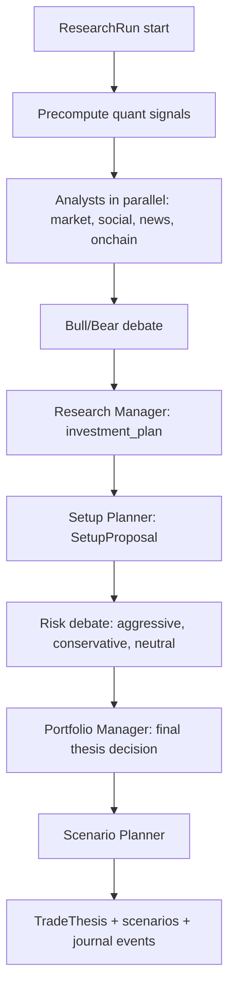
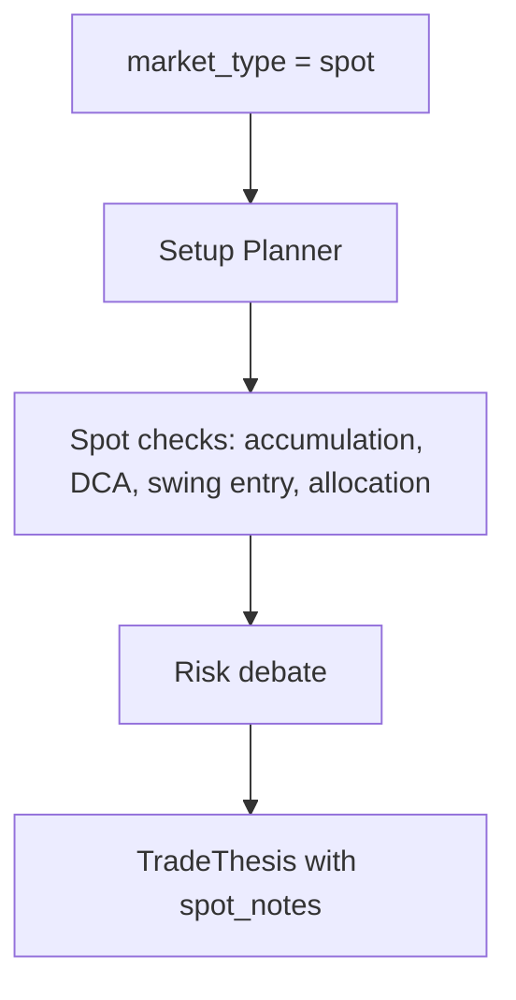
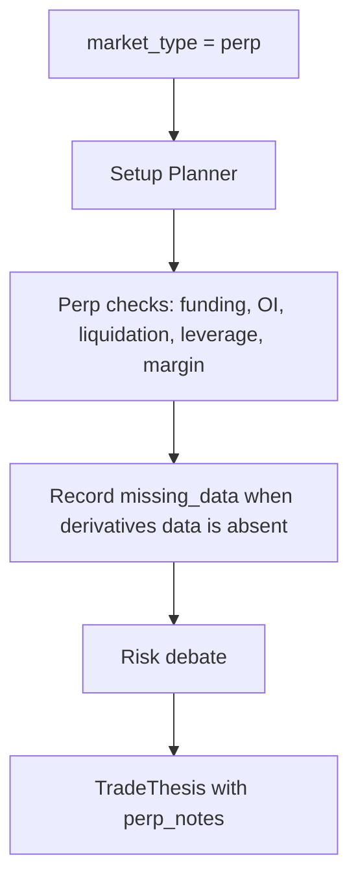
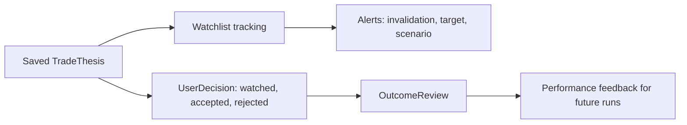
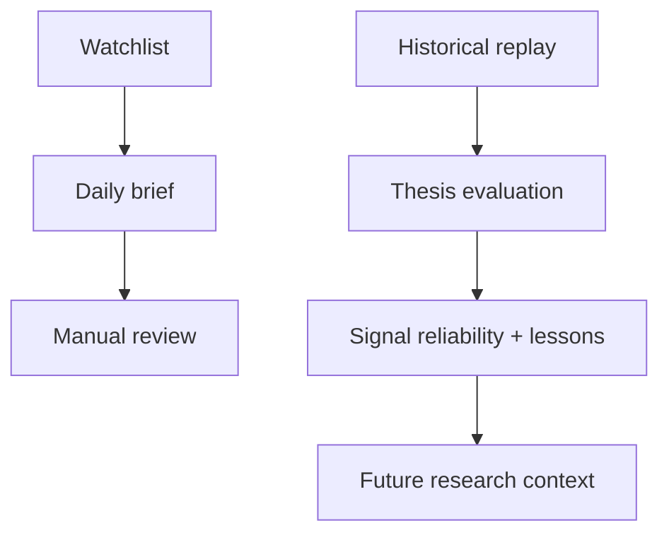

# LunaCrypto Workflow

This project is a crypto research workstation. It is not an autonomous trading
bot, live order router, broker system, or execution loop. The product produces
research artifacts for manual review: signals, debates, setup proposals,
theses, scenarios, journal events, and outcome reviews.

## Data Flow

```mermaid
flowchart LR
    Web["Web/API request"] --> API["NestJS API"]
    API --> Engine["Python engine request"]
    Engine --> Config["Config + workspace context"]
    Config --> Vendors["Data vendors: CCXT, CoinGecko, CryptoPanic"]
    Vendors --> Signals["Deterministic SignalEngine"]
    Signals --> Graph["Agent graph"]
    Graph --> Journal["SQLite/Postgres journal payloads"]
    Journal --> ReadAPI["Web read APIs"]
    ReadAPI --> UI["Research UI"]
```

| Artifact | Producer | Consumer | Purpose |
| --- | --- | --- | --- |
| `ResearchRun` | API/engine | journal, web | Run identity, workspace, symbol, asset class, market type, status |
| `Signal` | SignalEngine | agents, thesis builder | Deterministic factor evidence and provenance |
| `SetupProposal` | Setup Planner | risk analysts, Portfolio Manager | Spot/perp-aware setup for manual review |
| `TradeThesis` | Portfolio Manager + thesis builder | web, watchlist, evaluation | Final structured research thesis |
| `RunEvent` | engine/journal bridge | timeline UI | Audit trail for run progress, failures, and degradation |

## Agent Workflow

The Setup Planner is the canonical business role for the old internal
`Trader` step. The legacy state key `trader_investment_plan` remains for
compatibility, but UI labels, prompts, and reports should call the role
`Setup Planner`.

## Spot Research Flow

Spot research should focus on:

- Accumulation, DCA, or swing setup logic.
- Entry zone, invalidation, target zones, and time horizon.
- Capital allocation and liquidity constraints.
- Drawdown, news, sentiment, and on-chain flow risks.
- No leverage or margin assumption.

## Perp Research Flow

Perp research should focus on:

- Funding regime, open interest, long/short crowding, and liquidation risk.
- Stop distance, leverage cap, and margin risk.
- Carry cost and squeeze risk.
- Explicit `missing_data` if funding, OI, liquidation, or heatmap context is absent.
- No automated order placement.

## Thesis Lifecycle

The user remains responsible for the final decision. The system tracks what was
recommended, what the user decided, and how the thesis performed later.

## Daily And Historical Flows

Daily brief flow summarizes active symbols, saved theses, latest snapshots,
alerts, and missing data. Historical replay and evaluation are research tools,
not broker backtests: they should preserve no-lookahead boundaries and record
degradation when point-in-time data is unavailable.
