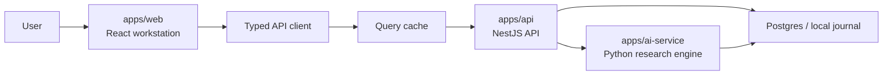

# Frontend System Design

Status: current architecture plus remaining design targets for `apps/web`.

LunaCrypto's current frontend is a Vite/React research workstation that consumes the existing NestJS API in `apps/api` and visualizes research output from the Python AI service.

## Product Boundary

The frontend is a research workstation, not a trading terminal and not an execution bot.

Primary user flow:

```text
Open workbench
-> review daily brief and alerts
-> launch or inspect a research run
-> read signals, snapshots, debate, and thesis
-> record a user decision
-> review thesis outcome later
```

The UI must make provenance visible near every decision surface: source, timestamp, freshness, missing data, degraded run reasons, model/provider metadata, and journal history.

## Goals

- Provide a dense, professional workspace for crypto research.
- Make active runs, generated theses, signals, alerts, and briefs easy to scan.
- Preserve a clear evidence trail from market data to signals to agent debate to final thesis.
- Keep decision and outcome review workflows one click away from the thesis detail page.
- Support local-first development now and hosted multi-workspace operation later.

## Current Implementation Snapshot

`apps/web` is implemented with:

- Vite, React, TypeScript, and React Router.
- TanStack Query for server state and polling-oriented reads.
- Axios transport in `src/services/client.ts`.
- Local header auth/workspace context through `src/store/useWorkspaceStore.ts`.
- API modules under `src/services/*` plus mirrored/generated contract types.
- Local CSS primitives in `src/styles/index.css`.

The current route set includes Workbench, Research New, Research History,
Research Run Workspace, Journal Run Workspace, Thesis Library/Detail, Signal
Explorer/Detail, Scenario Monitor, Alerts, Watchlists, Daily Briefs,
Operations, Settings, Performance, and Compare pages.

## Non-Goals

- No direct order execution.
- No PnL promises or investment advice language.
- No hidden AI decisions. Generated theses must expose assumptions, missing data, and contradiction signals.
- No marketing landing page inside the logged-in app.

## Stack Direction

The current stack is TypeScript React on Vite. Keep it unless SSR, server
components, or deployment requirements create a concrete need to move.

Recommended libraries and boundaries:

- React with TypeScript for UI.
- React Router for workstation routing.
- TanStack Query for API caching, background refresh, retries, polling, and mutation state.
- A thin API client aligned with `apps/api/src/contracts/frontend-contract.ts` and `apps/api/src/contracts/openapi.generated.ts`.
- Local component primitives first. Add a shared UI package only after a real reuse need exists.

## High-Level Architecture



Frontend ownership:

- Layout, navigation, screen state, optimistic UI, forms, and data presentation.
- API error mapping into useful user states.
- Polling or realtime subscription for run progress.
- Local presentation preferences such as filters, table columns, collapsed panels, and selected workspace.

Backend ownership:

- Authentication and workspace authorization.
- Research run execution and persistence.
- Journal, thesis, signal, alert, brief, and run event data.
- Provider/model health and operational metadata.

## Route Map

| Route | Purpose | Data dependencies |
| --- | --- | --- |
| `/workbench` | Daily command center with brief, active theses, alerts, watchlists, and recent runs | `GET /briefs/daily`, `GET /alerts`, `GET /theses`, `GET /watchlists` |
| `/research/new` | Launch a research run | `POST /research-runs` |
| `/research/runs/:id` | Run status, event timeline, snapshots, debate, artifacts, workflow visualization, and result links | `GET /research-runs/:id/workspace`, `GET /research-runs/:id/evidence-bundle` |
| `/journal/runs/:id` | Full evidence workspace for one run | `GET /journal/runs/:id/workspace`, `GET /journal/runs/:id/evidence-bundle` |
| `/theses` | Thesis inbox with filters | `GET /theses` |
| `/theses/:id` | Thesis detail, evidence, scenarios, decision, and review | `GET /theses/:id`, `/scenarios`, `POST /decision`, `POST /review` |
| `/signals` | Signal explorer by symbol, type, confidence, and freshness | `GET /signals` |
| `/watchlists` | Watchlist management and watchlist item creation | `GET /watchlists`, `POST /watchlists`, `GET /watchlists/:id/items`, `PATCH /watchlists/:id`, `POST /watchlists/:id/items`, `DELETE /watchlists/:id/items/:itemId` |
| `/briefs/daily` | Daily market brief archive | `GET /briefs/daily` |
| `/operations` | Provider health, LLM calls, freshness, run failures | `GET /operations/health`, `/provider-health`, `/llm-calls`, `/data-freshness` |
| `/settings` | Workspace, provider, model, and budget preferences | future settings endpoints |
| `/research/history` | Research run history | `GET /research-runs` |
| `/scenarios` | Scenario monitor | `GET /scenarios/monitor` |
| `/performance` | Outcome and reliability analytics | `GET /performance/*` |
| `/compare` | Thesis/run comparison | `GET /comparisons/theses`, `GET /comparisons/runs` |

## Layout Model

Use a persistent app shell:

- Left sidebar: global navigation.
- Top command strip: symbol search, spot/perp toggle, date/as-of selector, profile selector, run research button.
- Main content region: route-specific workspace.
- Optional right rail: contextual actions and AI explanation tools.

The app should feel like operational software: compact spacing, predictable navigation, dense tables, restrained color, and obvious loading/error states.

## Screen Designs

### Workbench

Purpose: show what requires attention now.

Primary panels:

- Daily brief summary with key points and linked thesis/signal IDs.
- Active thesis inbox grouped by status: new, watched, accepted, rejected, needs review, degraded.
- Watchlist alerts with unread state and mark-read action.
- Recent research runs with status, symbol, started/completed timestamps, and degradation chips.
- Signal board by symbol with freshness and direction.

Required states:

- Empty state for first run.
- Degraded-data banner when briefs or runs are missing core data.
- Background refresh indicator when polling active runs.

### Research Run Workspace

Purpose: inspect a single run while it is queued, running, completed, degraded, or failed.

Primary sections:

- Header: symbol, market type, status, model/profile, config hash, started/completed time.
- Agent workflow: event-derived organization chart with quant signal layer, selected analyst lanes, sequential manager stages, durations, and source-event counts.
- Timeline: run events in chronological order.
- Snapshots: market snapshot and signal snapshot.
- Debate: consensus stance, conflict level, agent opinions.
- Result: generated thesis link and scenario shortcuts.
- Raw event drawer for debugging.

The backend supplies `stage_timings` on workspace responses. Each stage timing
contains `stage_key`, `label`, `event_state`, `started_at`, `completed_at`,
`duration_ms`, and `source_event_ids`. The UI should keep visual stage status
derived from artifacts and use `stage_timings` for event-backed timing metadata.

Polling policy:

- Poll active runs every 3-5 seconds.
- Stop polling when status reaches a terminal state.
- Resume polling when the window refocuses and the run is still active.

### Thesis Detail

Purpose: turn research output into an explicit user-reviewed decision.

Primary sections:

- Thesis summary: rating, direction, confidence, setup type.
- Trade plan: entry zone, invalidation, target zones, spot notes, perp notes.
- Evidence: supporting signals, contradicting signals, stale or missing data.
- Scenarios: probability band, condition, expected behavior, suggested action.
- Decision form: action and notes.
- Outcome review form: result, invalidated flag, lessons.

Decision UX rules:

- Never bury invalidation level or missing data below the fold on desktop.
- Show decision history directly next to the decision form.
- Require explicit user action for decisions; do not infer acceptance from reading a thesis.

### Signals

Purpose: inspect deterministic evidence independent of AI text.

Table columns:

- Symbol
- Signal type
- Direction
- Confidence
- Observed at
- Source
- Source timestamp
- Freshness state
- Summary

Filters:

- Symbol
- Direction
- Signal type
- Min confidence
- Fresh/stale
- Source

### Operations

Purpose: explain trust and reliability.

Initial route can be read-only and driven by future endpoints:

- Provider health by provider and component.
- LLM calls by run, stage, agent, model, status, latency, and token count.
- Data freshness checks by source and symbol.
- Degraded or failed run audit.

This page matters because users need to distinguish a weak thesis from weak input data or a failing provider.

## API Client Design

Create a thin typed client around the product API. The client should:

- Attach `x-user-id` and `x-workspace-id` while local auth is header-based.
- Normalize API errors into a consistent frontend error object.
- Keep response types aligned with `apps/api/src/contracts/frontend-contract.ts`.
- Avoid hiding raw IDs; run IDs, thesis IDs, and signal IDs are useful support artifacts.

Example module shape:

```text
src/services/
  client.ts
  generated/api-client.ts
  query-keys.ts
  researchRuns.ts
  theses.ts
  signals.ts
  watchlists.ts
  briefs.ts
  alerts.ts
src/types/
  index.ts
```

## Query and Cache Policy

| Data | Query key | Refresh policy |
| --- | --- | --- |
| Research run | `researchRun(id)` | Poll while active |
| Run events | `researchRunEvents(id)` | Poll while active |
| Run workspace | `researchRunWorkspace(id)` / `journalRunWorkspace(id)` | Fetch on open, poll while active, refetch after run completion |
| Thesis list | `theses(filters)` | Refetch on decision/review mutation |
| Thesis detail | `thesis(id)` | Refetch after decision/review |
| Signals | `signals(filters)` | Manual refresh or short stale time |
| Alerts | `alerts(filters)` | Refetch after mark-read |
| Briefs | `dailyBrief(date)` | Long stale time per date |

Mutation policy:

- `POST /research-runs`: redirect to run workspace immediately after enqueue.
- `POST /theses/:id/decision`: optimistic disable form, then refetch thesis detail and thesis list.
- `POST /theses/:id/review`: same policy as decision.
- `POST /alerts/:id/read`: optimistic mark-read is acceptable because the mutation is low risk.

## State Model

Server state belongs in TanStack Query or equivalent.

Local UI state should be limited to:

- Active workspace ID and user ID while auth is local.
- Filters, sorting, selected tabs, collapsed panels.
- Draft form data.
- UI preferences.

Do not duplicate server entities into a global client store unless a feature requires cross-route editing.

## Auth and Workspace Context

Current API accepts workspace/user through headers:

```text
x-user-id
x-workspace-id
```

Frontend should wrap this behind an auth/workspace provider so the transport can later move to real sessions or JWT without rewriting screens.

Minimum local-development behavior:

- Default `workspace_id` to `local`.
- Default `user_id` to a local development user.
- Ensure the API has matching membership data through Postgres or `WORKSPACE_MEMBERSHIPS`; otherwise workspace-protected routes will reject the request.
- Expose workspace/user switching only in development or settings until real auth exists.

## Error and Loading UX

Use explicit states:

- Loading skeleton for first load.
- Inline refresh indicator for background refetch.
- Empty state when a list has no rows.
- Degraded state when the API reports missing core or optional data.
- Permission state when workspace access fails.
- Failure state for API/network errors with retry.

Research-specific error messages should preserve IDs and status fields so users can report a reproducible issue.

## Realtime Strategy

Initial version can use polling for active research runs. Add SSE or WebSocket later when long-running runs need lower latency and lower request volume.

Upgrade path:

```text
Polling active run endpoints
-> SSE stream for run events
-> WebSocket channel for active workspace notifications
```

The UI should isolate this behind a `useRunProgress(runId)` hook so transport changes do not affect screens.

## Accessibility and Responsive Behavior

- All tables must have readable empty, loading, and error states.
- Keyboard focus should move predictably through launch, decision, and review forms.
- Color cannot be the only signal for direction, status, or freshness.
- On mobile, collapse the left sidebar and stack panels; keep thesis rating, direction, invalidation, and decision action visible early.

## Delivery Plan

1. Scaffold `apps/web` with React and TypeScript.
2. Add app shell, routing, API client, and query provider.
3. Build Workbench with briefs, alerts, thesis list, watchlists, and recent runs.
4. Build research run workspace with polling events and snapshots.
5. Build thesis detail with scenario, decision, and review flows.
6. Build signal explorer and watchlist screens.
7. Add operations/settings routes after backend endpoints exist.

## Acceptance Criteria

- A user can launch a research run and inspect its status.
- A user can open a thesis, see evidence and missing data, record a decision, and later record an outcome review.
- Active run progress updates without page refresh.
- API response shapes are typed and aligned with the backend contract.
- No screen hides provenance, freshness, or degraded data when a decision is being made.
